# **Основы сетей. Часть 2: Прикладные подарки**
## **Содержание**
**Part 1. [Статическая маршрутизация](#part-1-Статическая-маршрутизация)**

**Part 2. [NTP](#part-2-NTP)**

**Part 3. [DNS](#part-3-DNS)**

**Part 4. [DHCP](#part-4-DHCP)**

**Part 5. [SSH](#part-5-SSH)**

## **Part 1. Статическая маршрутизация**
### 1. Cоздать новый проект GNS3, добавь в него три сетевых устройства (используй образ Cisco 3745), для удобства назовем их R1, R2 и R3. Соедини их между собой так, чтобы они образовывали «цепочку» (R1-R2-R3).

 **1.1 Создаем новый проект называем `static.gns3`**

 **1.2 Перетаcкиваем три устройства Cisco 3745 на рабочую область и называем их `R1` ,`R2` и `R3`.** 

 **1.3 Соеденяем их в "цепочку" (R1-R2-R3) - как просят из 2 задания!**
- R1 → F0/0 соеденяем с R2 → F0/0 

_R1 и R2 связаны через F0/0 (сеть 10.10.10.0/24)_

- R2 → F0/1 соедините с R3 → F0/0

_R2 и R3 связаны через F0/1 (R2) и F0/0 (R3) — сеть 10.10.20.0/24_

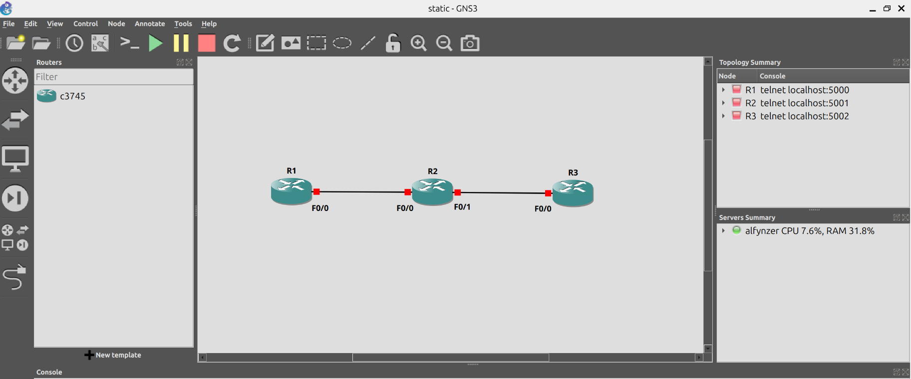

### 2. Настрой сетевые интерфейсы, которыми соединены R1 и R2, используя адресацию из сети 10.10.10.0/24. Интерфейсы, которыми соединены R2 и R3, настрой, используя адресацию из другой сети с маской /24.

#### 🔧 Настройка R1:
- Щёлкаем правой кнопкой по R1 → "Configure" → "Console" → нажмите "Start"
- Втерменале производим следующие манипуляции:

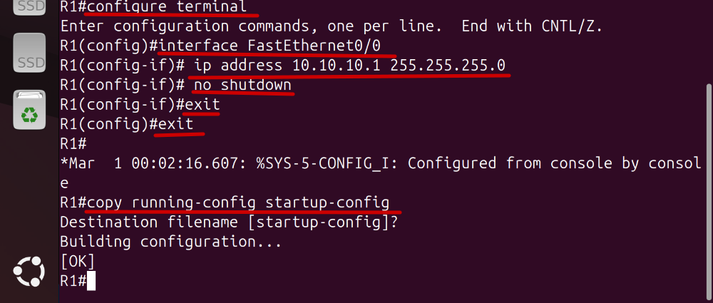

_R1: 10.10.10.1/24 — локальный интерфейс к R2_

#####  🔧 Настройка R2:
- Щёлкаем правой кнопкой по R2 → "Configure" → "Console" → нажмите "Start"
- В терменале производим следующие манипуляции:

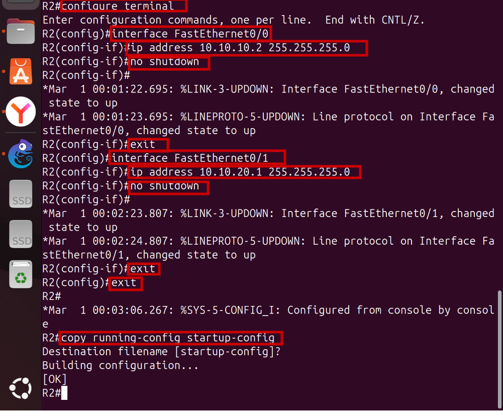

_F0/0: 10.10.10.2/24 (к R1)_

_F0/1: 10.10.20.1/24 (к R3)_

#### 🔧 Настройка R3:
- Щёлкаем правой кнопкой по R3→ "Configure" → "Console" → нажмите "Start"
- В терменале производим следующие манипуляции:

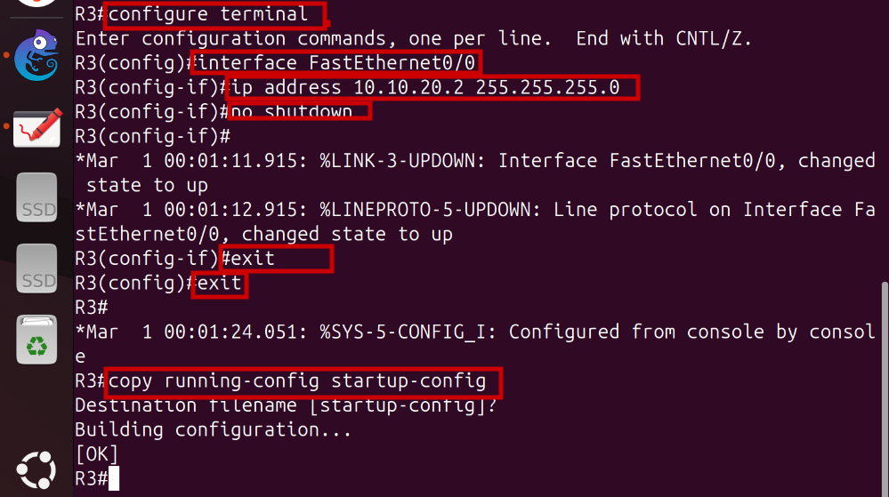

_R3: 10.10.20.2/24 — локальный интерфейс к R2_

### 3. Сконфигурируй статические маршруты на устройстве R1 до сети между R2 и R3 и ответный маршрут на устройстве R3 до сети между R1 и R2.

#### 3.1 На R1 — маршрут до сети R2–R3 (10.10.20.0/24)
- На R1 (через консоль):

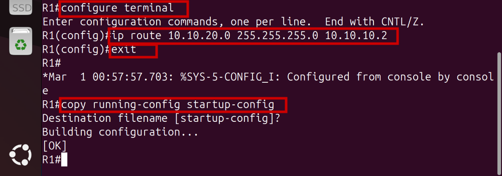

_R1 не знает, как попасть в 10.10.20.0/24, поэтому указываем шлюз — R2, который находится по адресу 10.10.10.2._
#### 3.2 На R3 — маршрут до сети R1–R2 (10.10.10.0/24)

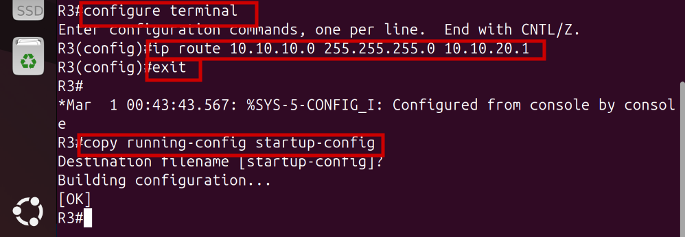

_R3 не знает, как попасть в 10.10.10.0/24, поэтому шлюз — R2 (10.10.20.1)_

#### 3.3 Проверка 
- `На R1:`

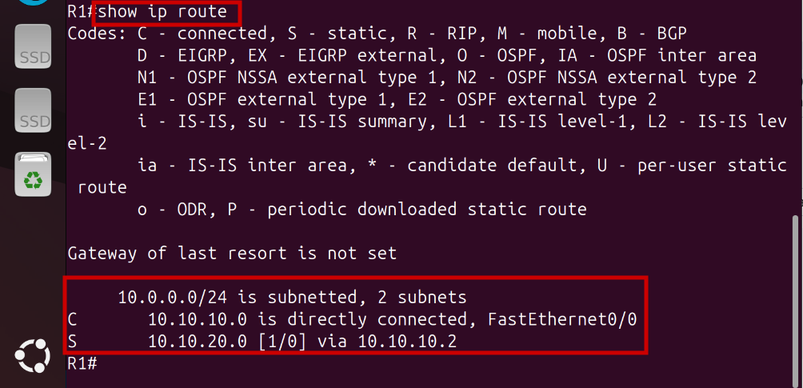

- `На R3:`

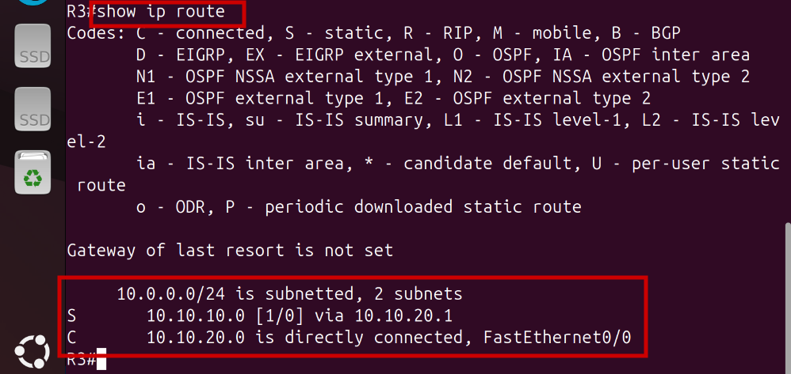

### 4. Запусти сбор пакетной трассы, выполни команду ping до IP-интерфейса противоположного устройства (от R1 к R3 или наоборот), убедись в наличии ответного трафика.

#### 4.1 На R1: `ping 10.10.20.2`

* `На R1:`

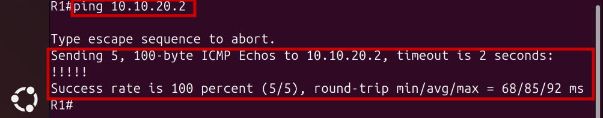

* `На R3:`

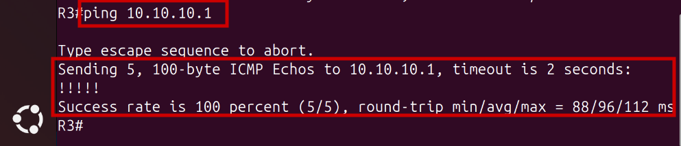

_R1 отправил пакет на R2 (по статическому маршруту)
R2 получил его, посмотрел таблицу маршрутизации → понял, что 10.10.20.2 — прямая связь → отправил на R3.
R3 принял пакет → ответил обратно через R2 → R2 вернул ответ R1
Все маршруты работают!_

### 5. В Wireshark изучи пакетную трассу и сохрани результирующий pcap-файл с именем `static`.

_Если не запускается Wireshark_ в терменале нужно прописать `sudo usermod -a -G wireshark $USER`

#### 5.1 На рабочей области GNS3 щёлкаем правой кнопкой по соединению между R1 и R2 (т.е. по кабелю между R1-F0/0 и R2-F0/0)
#### 5.2 Выбераем "Start capture" → появится окно Wireshark.
#### 5.3  В консоле на R1  вводим команду `ping 10.10.20.2`

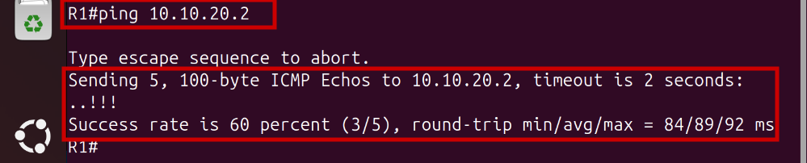

#### 5.4 Изучаем в Wireshark

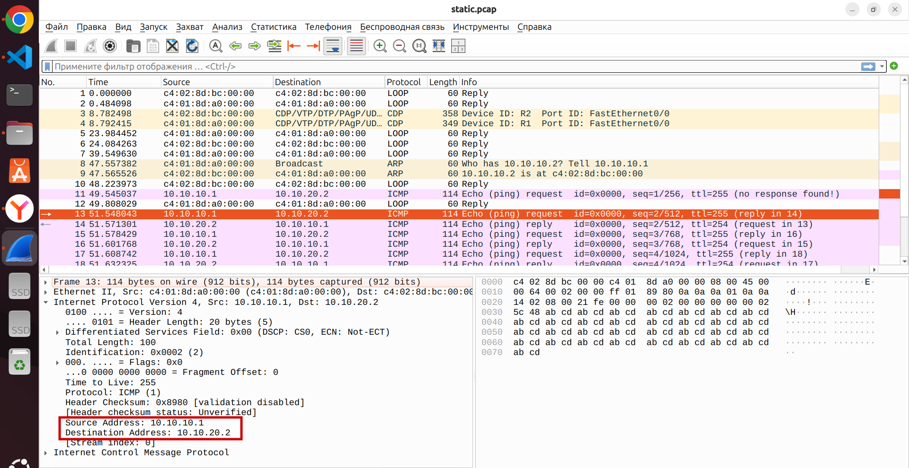

* Трафик идёт по ожидаемой цепочке R1–R2–R3–R2–R1
* В проект загружено два файла `.gns3` и `.pcap`

## **Part 2. NTP**
### 1. Для рассмотрения принципов работы NTP сконфигурируй на одном из устройств NTP-сервер.
1.1  Создаем проект `NTP.gns3`

1.2  Добавляем два устройства `R1` — будет NTP-сервер, `R2` будет NTP-клиент.

1.3  Соеденим их R1-F0/0 ↔ R2-F0/0 💡 (_Все устройства находятся в одной подсети: 10.10.10.0/24_)

1.4  Произведем надстройки IP-адресов интерфейсов
- На R1 (NTP-сервер):

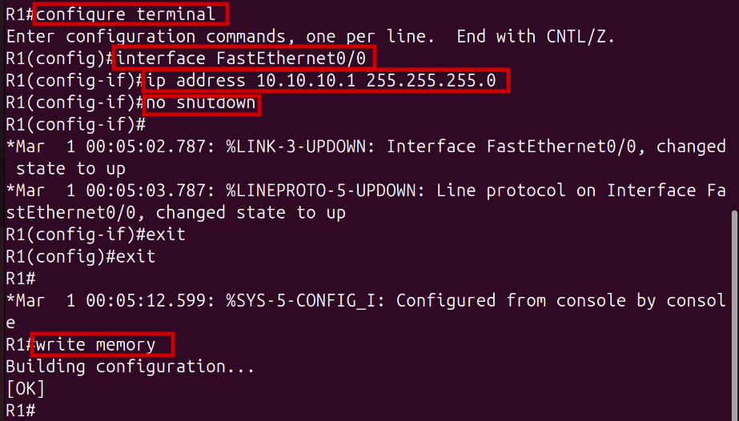

_`write memory` - еще один способ сохранить настройки_

- На R2 (NTP-клиент)

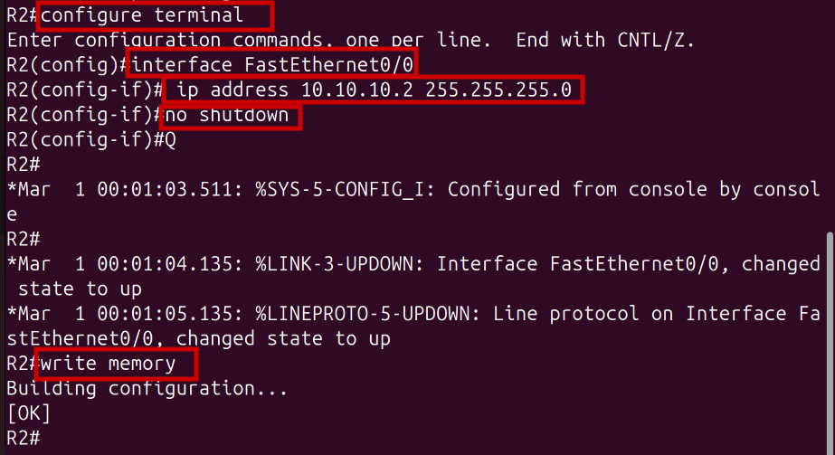

1.5 Настройка NTP-сервера на `R1`
- На R1 (NTP-сервер) включите службу NTP и укажите, что он является источником времени:

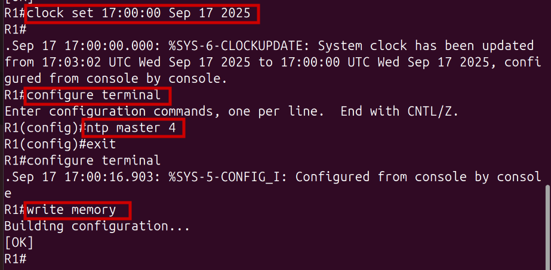

- `ntp master 4` — превращает устройство в источник времени уровня 4 (stratum 4).
- Теперь R1 — NTP-сервер, слушает UDP-порт 123.
### 2. На втором устройстве задай заведомо неверные значения текущего времени, запусти сбор трассы, укажи в качестве NTP-сервера устройство с настроенной службой NTP-сервера.

2.1 На R2 (клиент) — установим заведомо неправильное время (например, год 2020):

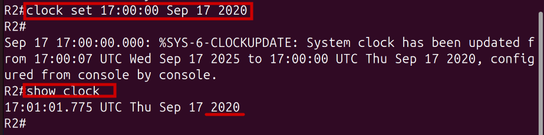

2.2 На R2 укажите R1 как NTP-сервер:

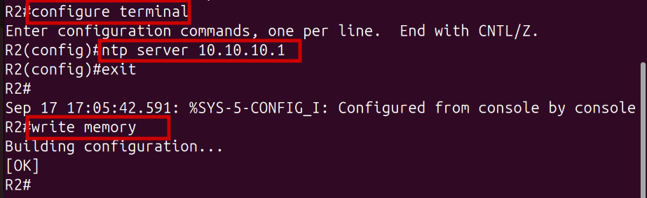

- Готово! R2 теперь будет запрашивать время у R1. 

### 3. Убедись в том, что время успешно синхронизировалось с NTP-сервером.

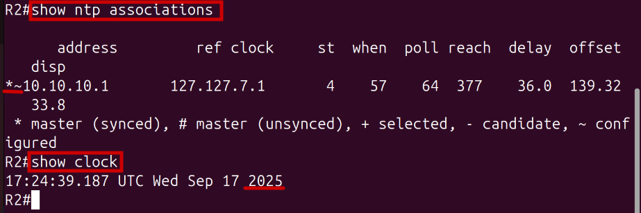

- *~ означает: текущий синхронизированный источник
- Время изменилось с 2020 года на 2025! — синхронизация прошла успешно!

### 4. Открой Wireshark и изучи результирующий файл пакетной трассы.
- Прочтем основные моменты

1. Какой протокол четвертого уровня (по OSI) используется для взаимодействия между NTP-клиентом и NTP-сервером?

   Ответ: UDP (User Datagram Protocol)

2. Какие source- и destination-порты при этом используются?
   
   Ответ:

     Source port: 123

     Destination port: 123
3.  Проверь передаваемое в первом NTP-пакете значение Transmit timestamp и запиши его.

    Ответ:

    Transmit Timestamp: Sep 17, 2025 17:30:54.404071157 UTC
### 5. Ответы запиши в текстовый файл с именем ntp.
- Создан фаил ntp.txt  и записанны результаты
### 6. В Wireshark сохрани результирующий pcap-файл с именем ntp
- Создан дамп и сохранен с имянем NTP.pcap

## **Part 3. DNS**
- Создадим новыцй проект `DNS.gns3`
- `R1` - DNS-сервер
- `R2` - DNS-клиент
- Соедините их Ethernet-кабелем `R1-F0/0 ↔ R2-F0/0`
### 1. Сконфигурируй на одном из устройств DNS-сервер, добавь в его конфигурации DNS-запись для сайта `my.site.`
- Настройка IP-адресов и loopback-интерфейса на R1 (DNS-сервер)

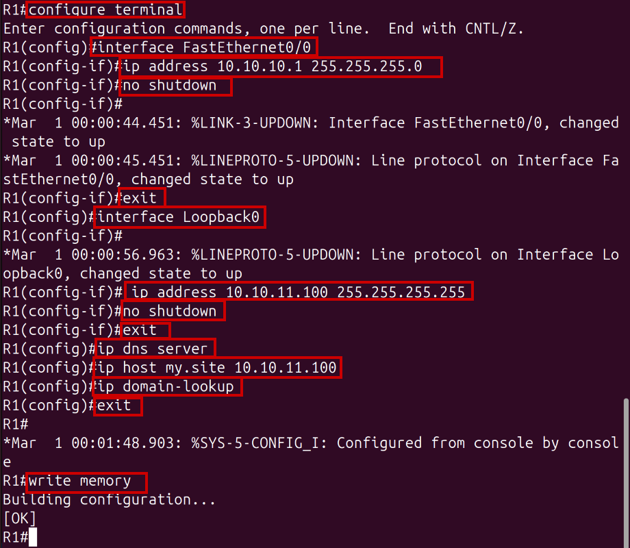

**Ключевые моменты настройки:**
- `configure terminal` - переход в режим конфигураций
- `interface FastEthernet0/0` - переходим в настройки конфигурации интерфейса FastEthernet0/0
- `ip address 10.10.10.1 255.255.255.0` - назначаем ip и маску подсети
- `no shutdown` - включаем сетевой интерфейс (порт)
- `exit` - выход из настройки на шаг назад
- `interface Loopback0` - создание стабильного и надежного цифрового идентификатора (loopback-интерфейс)
- `ip address 10.10.11.100 255.255.255.255` - настройка DNS-сервера с loopback-интерфейсом
- `ip dns server` - включает службу DNS-сервера на маршрутизаторе
- `ip host my.site 10.10.11.100` - cоздаёт статическую DNS-запись, связывающую имя my.site с IP-адресом 10.10.11.100. 
- `ip domain-lookup` - включает разрешение имён (DNS-запросы) на этом устройстве
- `write memory` - сохраняет конфигурации
### 2. На соседнем устройстве настрой использование узла с включенной службой DNS в качестве DNS-сервера.
- Настройка R2 — DNS-клиент

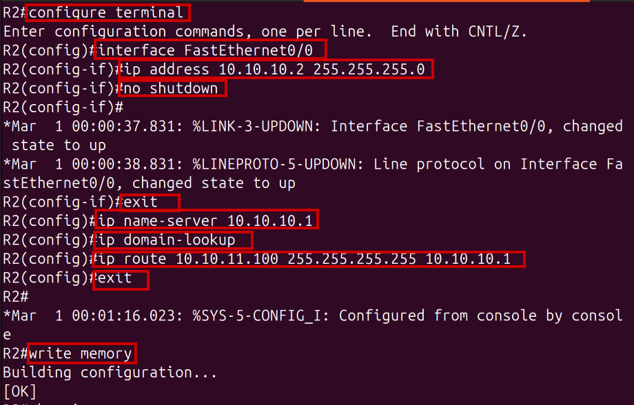

**Ключевые моменты настройки:**
- `ip name-server 10.10.10.1` - указывает, какой сервер использовать
- `ip route 10.10.11.100 255.255.255.255 10.10.10.1` -Это статический маршрут, который позволяет R2 достичь loopback-адреса R1 (10.10.11.100), даже если он в другой подсети

### 3. Запусти сбор трассы, выполни команду ping my.site, убедись в том, что имя разрешилось в IP-адрес

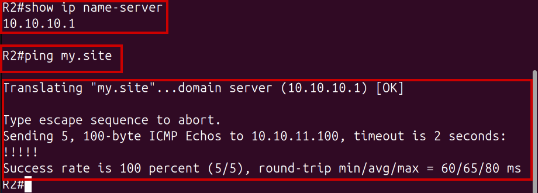

💡 Добавление loopback-интерфейса позволяет сохранить доступность сервиса при перезапуске физических интерфейсов.

### 4. Открой в Wireshark результирующий файл пакетной трассы, отфильтруй пакеты, используя фильтр dns, и изучи содержимое пакетов. Обрати внимание на то, какие source- и destination-порты используются при DNS-запросах и ответах.

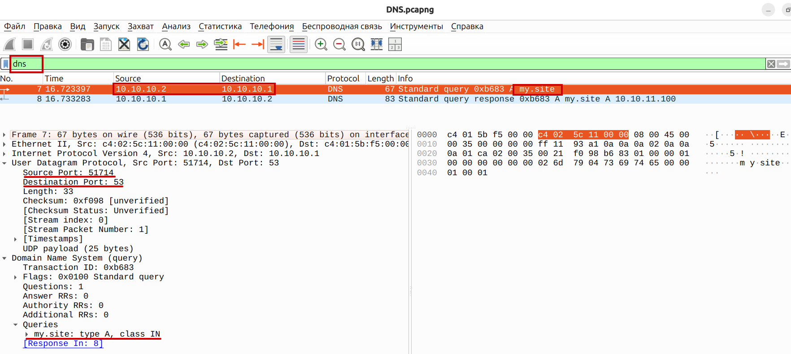

**Пояснения к скрину:**
- Отфильтровано по `dns`
- Первый пакет от R2 к R1 — это DNS-запрос (Client → Server). В колонке "Info"  - `my.site`
- Domain Name System → Query Name: my.site

      → Type: A         
      → Class: IN    
- Порты :     

      → Source Port: случайный высокий порт (например, 51714) — это порт клиента (R2)       
      → Destination Port: 53 — стандартный порт DNS-сервера (R1)

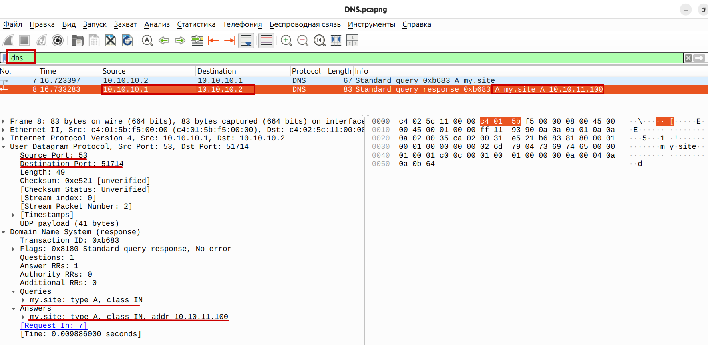 

**Пояснения к скрину:** 
  Во втором пакете (ответ от R1 к R2):
- Type: A (в ответе тоже указывает на IPv4-адрес)
- Class: IN
- Answer: my.site has address 10.10.11.100
- Source Port: 53 (DNS-сервер)
- Destination Port: тот же случайный порт, что был у клиента  (51714)

**Выводы:**
- Имя my.site успешно разрешилось в IP-адрес 10.10.11.100
- DNS-запрос и ответ прошли корректно
### 5. Ответь на вопрос:Какие тип и класс запроса видны в DNS-запросе? Ответ запиши в текстовый файл с именем dns.
- Ответ:

      → Type: A  (Host address)       
      → Class: IN  (Internet)
## **Part 4. DHCP**

### 1. Добавь в ранее созданный проект GNS3 объект виртуального ПК (vPC), подключи его к одному из устройств Cisco
- Создадим дубликат из предыдущего проекта `DNS.gns3` назовем `DNS-DHCP.gns3`
- Перетащим устройство `VPCS`  и подключем к `R1` кабелем `f0/0 → f0/1`

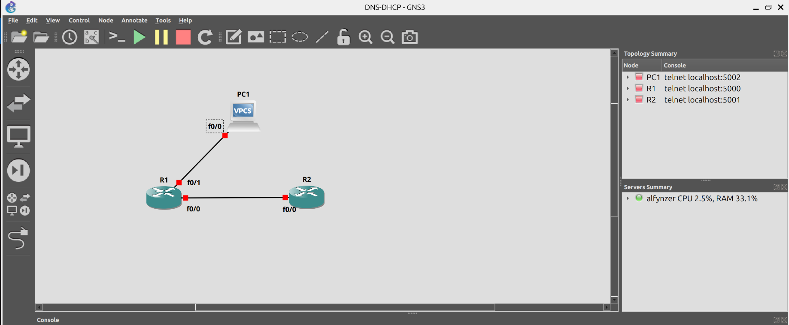

### 2. Настрой на Cisco интерфейс (с адресацией из сети 10.10.30.0/24), к которому подключен vPC, настрой DHCP-сервер на выдачу 50 ip-адресов из этой же сети.

**Пояснения к скрину:**
- Используем IP из сети 10.10.30.0/24 — но с маской /26 (ВХОДИТ В 10.10.30.0/24!)
- Исключаем зарезерьвированые адреса на выдачу 10.10.30.0 -сеть. 10.10.30.63 - локальный broadcast
- Исключаем адреса с `.52` по `.62` DHCP выдаёт: .2–.51 — ровно 50 IP

### 3. Запусти сбор трассы, настрой на vPC получение ip по DHCP.

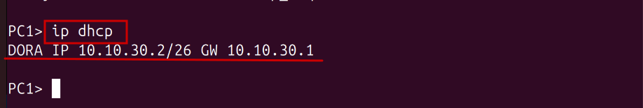

- Получили адрес 10.10.30.2 /26

### 4. Выполни c vPC ping до ip адреса устройства, к которому он подключен.

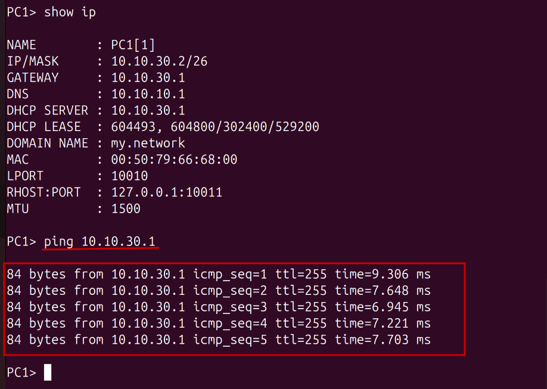

### 5-6. В Wireshark ознакомься с содержимым DHCP- и ICMP-пакетов. Сохрани полученный дамп в файл dhcp.pcap Ответь на вопрос:
- Что означает вывод “DDORA IP ….” при DHCP запросе - каким DHCP-пакетам из пакетной трассы DORA соответствует?
- На какой ip адрес отправляется первый dhcp пакет?
- Ответы запиши в текстовый файл с именем “dhcp”.

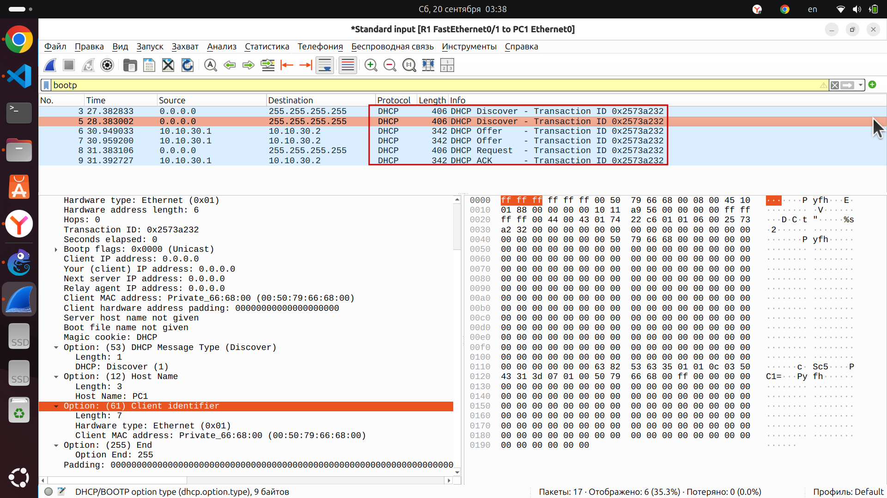

Что означает вывод “DORA IP ….” при DHCP-запросе — каким DHCP-пакетам из пакетной трассы DORA соответствует?

Ответ:
  DORA — это аббревиатура четырёх этапов DHCP-обмена:
  - D: DHCP Discover — клиент ищет DHCP-сервер
  - O: DHCP Offer — сервер предлагает IP-адрес
  - R: DHCP Request — клиент подтверждает выбор IP
  - A: DHCP Ack — сервер подтверждает выдачу IP
  Этим этапам соответствуют 4 пакета в трассе: DHCP Discover → DHCP Offer → DHCP Request → DHCP Ack

На какой IP-адрес отправляется первый DHCP-пакет?

Ответ:
  Первый DHCP-пакет (DHCP Discover) отправляется на широковещательный адрес: 255.255.255.255.
  Это необходимо, потому что клиент ещё не имеет IP-адреса и не знает адреса сервера.

## **Part 5. SSH**
### 1. Настрой SSH на одном из устройств — в числе прочего необходима настройка VTY, создание пользователя, генерация RSA-ключей.

- Создаем новый проект `ssh.gns3`
- Создаем два роутера Cisco 3745 `R1` -сервер; `R2` -клиент
- Соеденяем их `R1-F0/0 ↔ R2-F0/0`

**На R1 (SSH-сервер):**

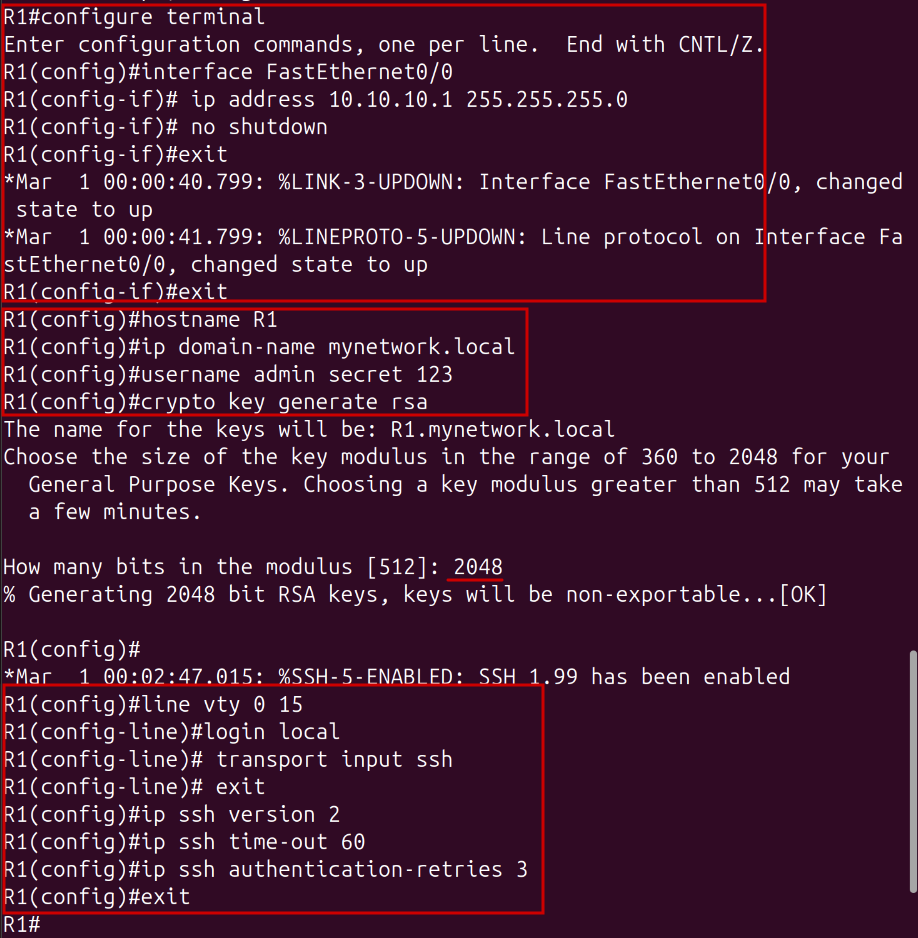

- ! не забываем сохранить `write memory`

**Основные этапы настройки:**
- `interface FastEthernet0/0` - настройка `ip` по аналогии с предыдущими заданиями
- `ip domain-name` mynetwork.local - обязателен для генерации ключей
- `crypto key generate rsa 2048` - обязательно, иначе SSH не заработает
- `transport input ssh` -  запрещает telnet на VTY-линиях

**На R2 (SSH-клиент):**
- Никаких дополнительных настроек не нужно — R2 будет только клиентом. 

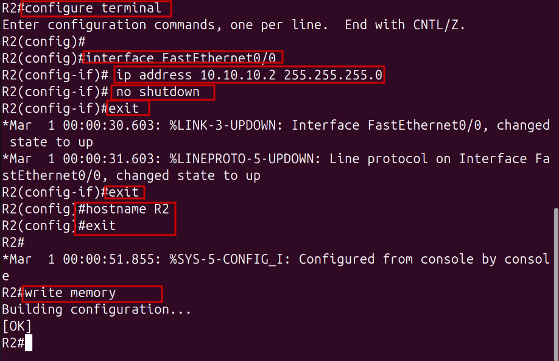

**Проверка SSH-сервера на R1**

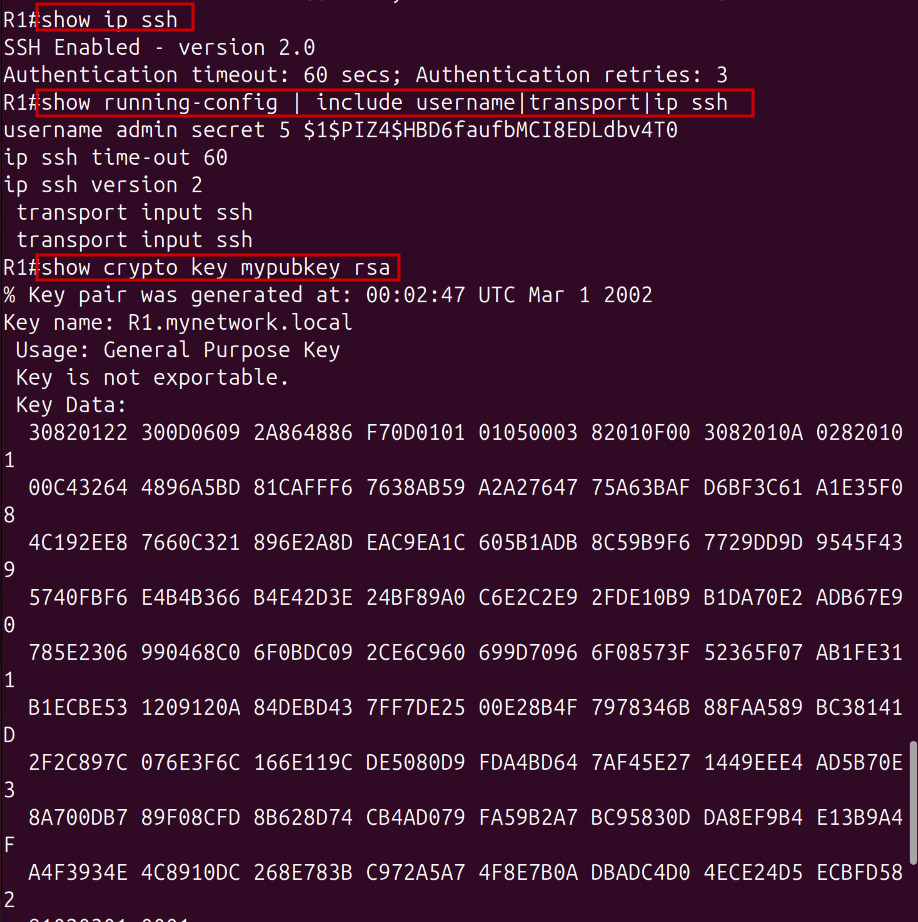

### 2. Запусти сбор пакетной трассы, проверь доступность 22-го порта на соседнем устройстве утилитой telnet.

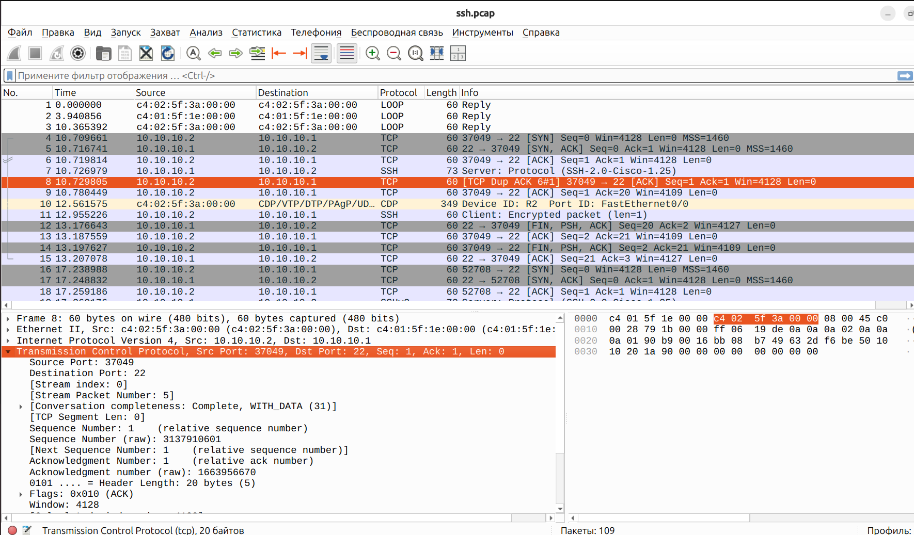

### 3. Выполни подключение на соседнее устройство по SSH с учетными данными созданного на первом шаге пользователя, после ввода пароля и успешного подключения выполни отключение командой exit.

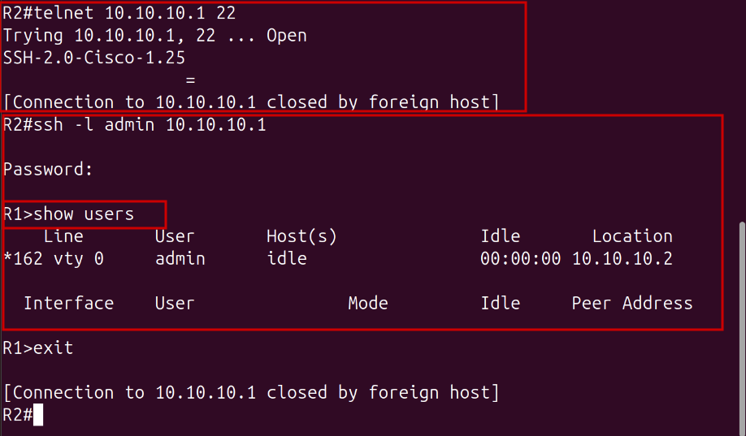

_Примечание: SSH обеспечивает безопасную аутентификацию и шифрование, в отличие от Telnet._

### 4. В Wireshark ознакомься с содержимым пакетов запроса telnet и ответного трафика, изучи структуру TCP-пакета, флаги в TCP и последовательность выполнения TCP-handshake.

- Сохрани результирующий pcap-файл Wireshark с именем ssh.
- В качестве ответа приложи: файл проекта gns3, pcap-файл с именем ssh.

## **Дополнительно изучено:**

- Принципы работы ICMP, ARP, DNS, DHCP и NTP
- Конфликты IP-адресов и их устранение
- Различия между TCP и UDP при передаче данных
- Основы защиты сетей от атак на уровне L2 и L3

## **В рамках образовательного процесса, реализуемого школой School 21, был осуществлен проект.Представленный материал носит ознакомительный характер и предназначен для ознакомительных целей. Категорически не рекомендуется его копирование и размещение на образовательных платформах от имени третьих лиц во избежание нарушений академической честности и этических норм, связанных с плагиатом.**
